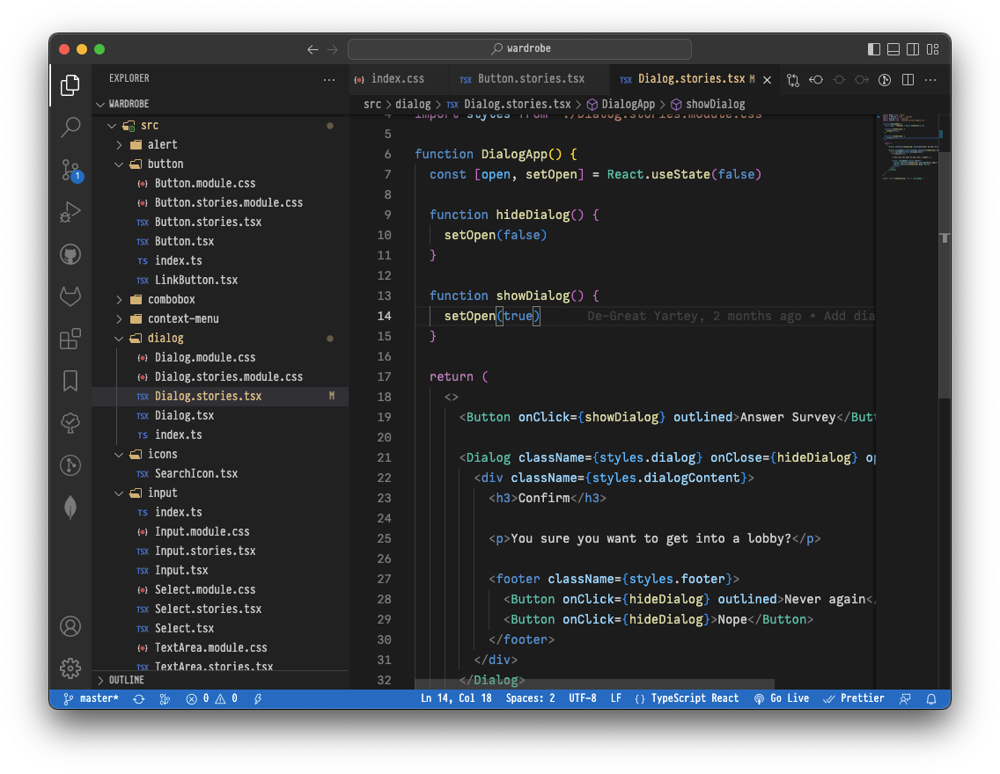

# fonted

An extension to change the UI font of vscode. That's all it does.

> [!IMPORTANT]
> For Cursor (and some other vs clone forks), the marketplace doesn't stay up to date with the current version of Fonted. Please use the [Releases](https://github.com/blackmann/fonted/releases) page.

## Usage

After installation, provide the setting: `"fonted.font": "Pragmata Pro Mono"`,  run the `Fonted: Enable` command (from the command pallette). Then restart.

Ignore the notification: "Your Code installation appears to be corrupt. Please reinstall."

