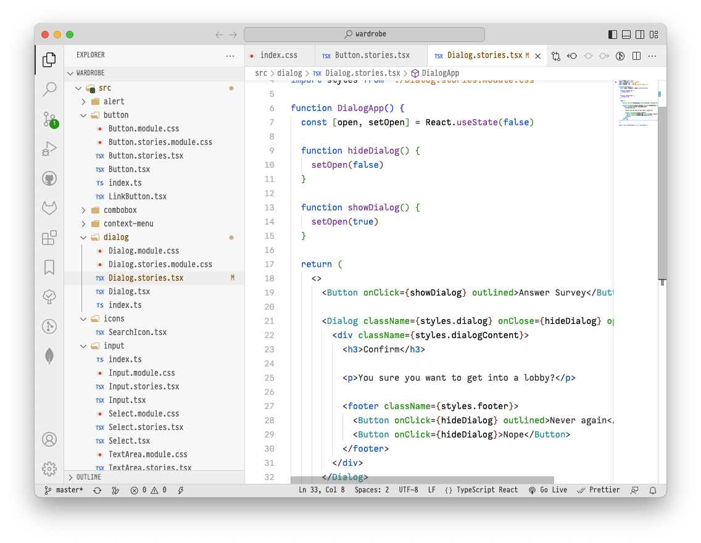

# fonted

An extension to change the UI font of vscode. That's all it does.

<table>
<tbody>
<tr>
<td></td>
<td></td>
</tr>
</tbody>
</table>

## Usage

After installation, run the `Fonted: Enable` command (from the command pallette). Then restart.

Ignore the notification: "Your Code installation appears to be corrupt. Please reinstall."

